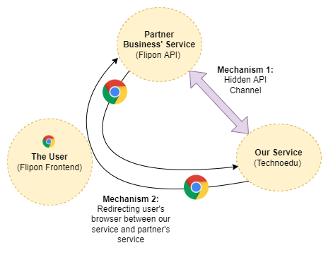
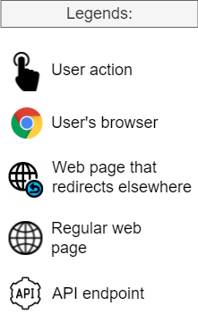
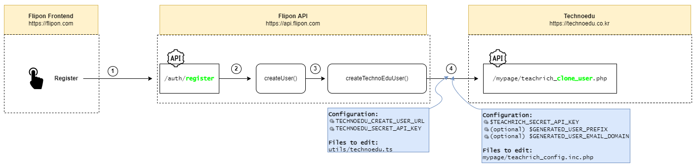
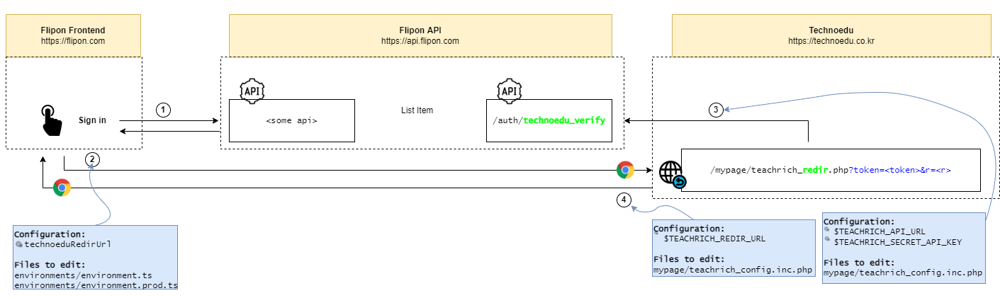
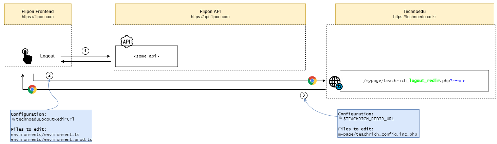
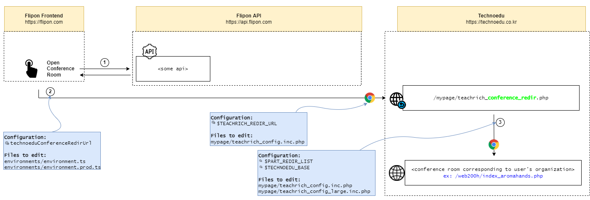

# 0. Architecture

There are 3 separate components:

* **Flipon Frontend (or, the user)**: runs completely in user-side context (that is, it represents users of partner business).
* **Flipon API (or, the service of partner business)**: runs in (partner) business context.
* **Technoedu (or, our own service)**: runs in (our own) business context.

Our **main goal** is: to allow users of partner business' service (Flipon API) to use our service (Technoedu).



To achieve this, we use the following mechanisms:

2. (Hidden from user and their browser) **API channel between our service and partner business** - There are 2 cases this channel is used for:
    * Use case 1: Whenever a user registers at the service of partner business, partner business sends request to make a clone of that user in our service using this API channel.
    * Use case 2: Whenever a user signs in, partner business (Flipon API) issues a JWT token to them. User (that is, their browser) then can use this JWT token to authenticate themselves. So, when the user wants to use our service (Technoedu) they send us this token. To verify it's a real user of partner business' service, we send this token to partner business (using this API channel) and partner business responds if it's real user or not. Based on that response, we either allow the user to sign in to our service or ignore their request.
3. (Visible to user and their browser) **Redirecting the user's browser between our service and partner business' service**: 
    * General use case: Whenever a user successfully signs in to partner service, they are redirected to our service with the token they were issued. For example, if the user signed in and got token `"SomeSecretToken"`, then they are redirected to this URL: `<URL of Our Service>?token=SomeSecretToken`. After signing in the user in our service as well, we redirect the user back to partner's service. Logout process works similarly. "Open conference room" functionality works also similarly, but instead of redirecting the user back to partner's service, we redirect them to the corresponding conference room page.

# 1. Configuration and Deployment

Deploying these services doesn't involve anything non-traditional. The only important part of
deployment is properly setting the configuration values.

Configuration values will change depending on where (that is, which URL) you will deploy Flipon
Frontend, Flipon API, and Technoedu services.

Below I gave descriptions of configuration values.

## 1.1. Configuration

To understand the descriptions here better, please refer to the diagrams from "How It Works" section below first.

Configuration for __Flipon Frontend__:

* File: `environments/environment.ts`
    * (For production env, change file: `environments/environment.prod.ts`)
    * `technoeduRedirUrl`: full URL (including Technoedu base URL) to `mypage/teachreach_redir.php` file
        * Ex: `"https://technoedu.co.kr/mypage/teachreach_redir.php"`
    * `technoeduLogoutRedirUrl`: full URL (including Technoedu base URL) to `mypage/teachreach_logout_redir.php` file
        * Ex: `"https://technoedu.co.kr/mypage/teachreach_logout_redir.php"`
    * `technoeduConferenceRedirUrl`: full URL (including Technoedu base URL) to `mypage/teachreach_conference_redir.php` file
        * Ex: `"https://technoedu.co.kr/mypage/teachreach_conference_redir.php"`

Configuration for __Flipon API__:

* File: `utils/technoedu.ts`
    * `TECHNOEDU_CREATE_USER_URL`: full URL (including Technoedu base URL) to `mypage/teachreach_clone_user.php` file
        * Ex: `"https://technoedu.co.kr/mypage/teachreach_clone_user.php"`
    * `TECHNOEDU_SECRET_API_KEY`: a randomly generated API key used to make sure only Flipon can use "clone user" API endpoint.
        * NOTE: Should have same value as `$TEACHRICH_SECRET_API_KEY` config for Technoedu
        * Ex: `"OWpj2Sq1ld7cEAp1"`

Configuration for __Technoedu__:

* File: `mypage/teachrich_config.inc.php`
    * `$TEACHRICH_API_URL`: base URL for Flipon API. Used to query Flipon API for checking validity of signin tokens sent by Flipon Frontend.
        * Ex: `"https://api.flipon.com"`
    * `$TEACHRICH_SECRET_API_KEY`: a randomly generated API key used to make sure only Flipon can use "clone user" API endpoint.
        * NOTE: Should have same value as `TECHNOEDU_SECRET_API_KEY` config for Flipon API
        * Ex: `"OWpj2Sq1ld7cEAp1"`
    * `$TEACHRICH_REDIR_URL`: Flipon Frontend URL used to redirect users after sign in or logout back to Flipon Frontend.
        * Ex: `"https://flipon.com/home"`
    * `$TECHNOEDU_BASE`: base URL for Technoedu. Used for redirecting the user to the right conference room.
        * Ex: `"https://technoedu.co.kr"`
    * (optional) `$GENERATED_USER_PREFIX`: prefix to use while cloning Flipon users to Technoedu users.
        * NOTE: You don't need to modify the default value.
        * NOTE: Technoedu generates used IDs itself instead of using Flipon usernames.
        * Ex: if the value is `"_gen_"`, then cloned user IDs will be: `_gen_1`, `_gen_2`, etc.
    * (optional) `$GENERATED_USER_EMAIL_DOMAIN`: email domain used for assigning email addresses to cloned users.
        * NOTE: You don't need to modify the default value.
        * NOTE: Technoedu assigns "fake" emails (using `Flipon username + @ + fake email domain`) instead of using real Flipon user emails.
        * Ex: `"@generated.teachrich.io"`. In this case, a Flipon user `honggil` will be assigned `honggil@generated.teachrich.io` email.

* File: `mypage/teachrich_config.inc.php`
    * `$PART_REDIR_LIST`: list of mappings between organization and its corresponding conference room URL.
        * NOTE: "part" means organization user is part of. For example: "wooksung", "hanbat", "kaist", etc.
        * NOTE: Each organization has its own separate conference room. So when a user clicks "open conference room", users organization ID is used to open the right conference room.
        * Ex:
            ```
            $PART_REDIR_LIST = array(
                "wooksung" => "/web200h/index_wooksung.php",
                "hanbat" => "/web200h/index_hanbat.php",
                "kaist" => "/web200h/index_kaist.php",
            );
            ```

## 1.2 Deployment

* __Flipon API__ - deploy it like a regular Node.js app.
* __Flipon Frontend__ - deploy it like a regular Angular.js app.
* __Technoedu__ - deploy it like a regular PHP app.
    * I didn't change the database schema, so there is no need to change anything in the MySQL database.

**A security note:** make sure to deploy __Flipon API__ and __Technoedu__ on `https` URLs, so API key used between these services can't be stolen.

# 2. How It Works

There are 4 user actions that are related to my code:

* Register
* Sign In
* Logout
* Open Conference Room

For the "flow" of these actions, see the diagrams below.

What the icons in the diagrams mean:



## 2.1. User Action: Register



## 2.2. User Action: Sign In



## 2.3. User Action: Logout



## 2.4. User Action: Open Conference Room



